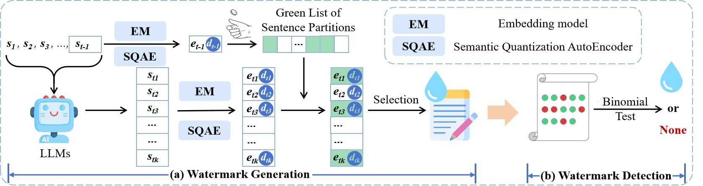

# Semantic-oriented Robust Text Watermark for LLMs

This repository provides the source code for ACL ARR 2024 December blind review.


## Introduction

In this paper, we propose a novel Semantic-oriented Robust Text Watermark for LLMs (SoTW) for robust sentence-level watermarking.
Different from existing sentence-level methods, we innovatively propose to use a learnable discrete representation to directly represent different partitions. 
Specifically, we first leverage pre-trained embedding models (e.g., BGE-M3) to generate sentence embeddings. 
Then, instead of finding the partition anchors and calculating the distance, we design a novel semantic quantization autoencoder (SQAE) to generate the discrete representations by taking the sentence embeddings as the input. 
Since the discrete representation will lose important semantic information, we develop a semantic loss to ensure that discrete representations can maintain as much information as possible. 
Moreover, considering that sentences with the same semantics can be expressed in multiple different ways, we design a consistency loss to improve the generalization of the partition boundaries. 
Along this line, LLMs generated sentences can be accurately assigned to corresponding partitions, thus improving the robustness and generalization of sentence-level watermarking. 




## Dependencies

Here are the versions of packages we use for the implementation of experiments.


| Library          | Version  |
|------------------|----------|
| `Python`         | `3.9`    |
| `pytorch`        | `2.3.0`  |
| `torchvision`    | `0.18.0` |
| `transformers`   | `4.42.3` |
| `numpy`         | `1.22.4` |
| `FlagEmbedding`           | `1.2.10` |
| `scipy`          | `1.7.3`  |


## Training SQAE

First, generate the embedding of MultiNLI as training data: 

```console
cd SQAE
python generate_embeddings_multi_nli.py \
--input_path = The path of multi_nli \
--output_path = Output result path \
--model_path = Embedding model, e.g., 'BAAI\bge-m3' \
```


Then, training SQAE:

```console
python train_SQAE.py 
```


## Watermark Generation

Here is the process of watermark generation:

```console
python gen_watermark.py \
--model = LLMs, e.g., 'Llama-2-7b-chat-hf' \
--data = Prompts data path \
--out_dataset_path = Results path \
--data_size = Number of generated watermark texts \
--embedder = Embedding model, e.g., 'BAAI\bge-m3' \
--checkpoint = Path of SQAE\
--checkpoint_dim = Number of sentence partitions constructed by SQAE \
```


## Watermark Detection

Here is the process of watermark detection:

```console
python detect_watermark.py \
--dataset_path = Path of text to be detected \
--out_dataset_path = Results path \
--data_size = Number of detected watermark texts \
--embedder = Embedding model, e.g., 'BAAI\bge-m3' \
--checkpoint = Path of SQAE\
--checkpoint_dim = Number of sentence partitions constructed by SQAE \
```


